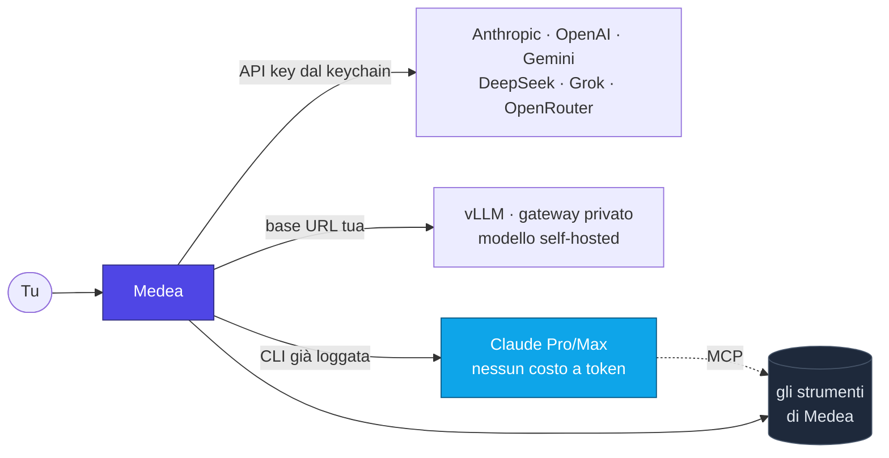
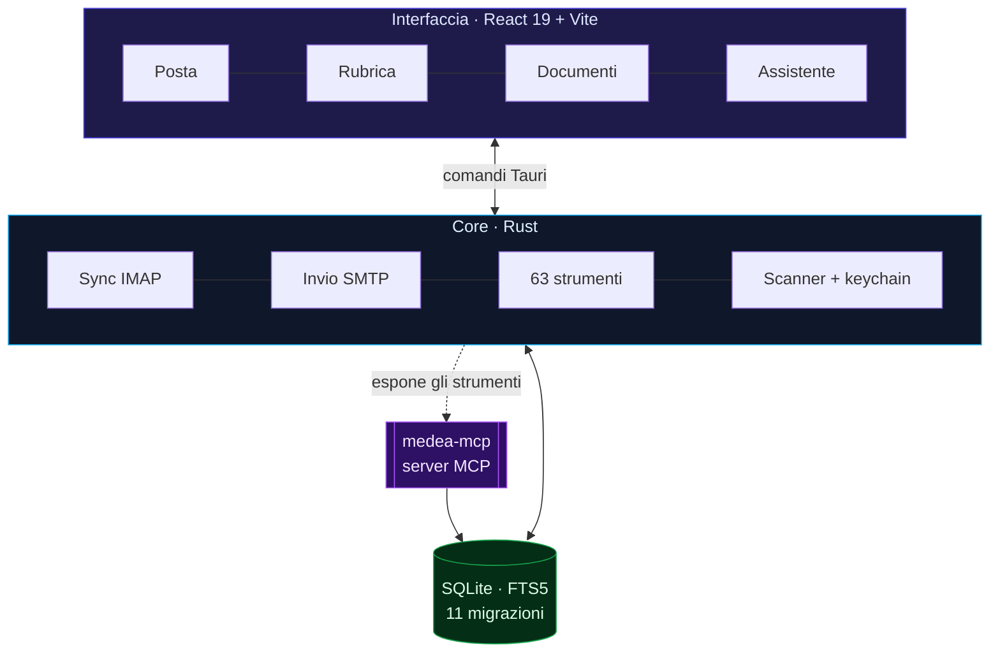

<div align="center">


<br>

[](https://tauri.app)
[](https://www.rust-lang.org)
[](https://react.dev)
[](https://www.typescriptlang.org)
[](https://sqlite.org)

**La posta smette di essere una cosa da smaltire e diventa memoria consultabile.**

[Cosa fa](#cosa-fa-davvero) · [Installazione](#installazione) · [Architettura](#architettura) · [AI e privacy](#ai-la-tua-chiave-o-il-tuo-abbonamento) · [Sviluppo](#sviluppo)

</div>

---

## Perché esiste

Un client email normale ti mostra una lista. Poi sei tu a ricordare chi ti doveva
rispondere, cosa avevi promesso a quel cliente tre mesi fa, e dove era finito
quel preventivo.

Medea ribalta il rapporto: le email sono il **log narrativo del lavoro** —
identità, relazioni, accordi, decisioni — e il client serve a **ridurre il carico
cognitivo**, non ad aggiungerne. Tutto il resto è decorazione.

> [!NOTE]
> Medea è **neutra**: nessun verticale di settore, nessun dato precablato.
> Anagrafiche, articoli, listini e documenti sono strutture generiche,
> utilizzabili da qualsiasi azienda.

---

## Cosa fa davvero

<table>
<tr>
<td width="50%" valign="top">

### 📬 Posta, seriamente

Sync IMAP incrementale con dedup per `message-id`, cartelle multiple, ricerca
**full-text FTS5** istantanea su oggetto, mittente e corpo. Allegati analizzati
da uno scanner di sicurezza: magic-byte, doppia estensione, macro Office,
zip-bomb, JavaScript nei PDF.

**IMAP è read-only per policy**: nessuna cancellazione sul server, mai.

</td>
<td width="50%" valign="top">

### 🧠 Memoria operativa

L'assistente ricorda i fatti durevoli tra le conversazioni — preferenze di un
cliente, accordi presi, scadenze — su una tabella dedicata che è la stessa
che vedono i suoi strumenti.

Non è una chat con la memoria a pesci rossi appiccicata sopra.

</td>
</tr>
<tr>
<td width="50%" valign="top">

### ✍️ Scrittura con carta intestata

Editor del template con logo, intestazione, colori e piè di pagina, anteprima
live. Layout a tabelle con stili inline e immagini incorporate, perché Outlook
e Gmail non digeriscono altro. Si applica a messaggi nuovi e risposte.

</td>
<td width="50%" valign="top">

### 🤝 Contatti che sanno di email

Rubrica auto-popolata dal sync, raggruppata per dominio. Per ogni contatto,
tutte le email scambiate — ricevute e inviate — in un pannello solo.
Anagrafiche, articoli, listini e documenti quando servono.

</td>
</tr>
</table>

### Gli strumenti dell'assistente

L'AI non è un chatbot incollato di lato: ha **63 strumenti** che agiscono davvero
sul sistema, con i nomi allineati all'app Liara così lo stesso modello
fine-tuned funziona su entrambe.

<details>
<summary><b>Vedi tutti gli strumenti</b></summary>

<br>

| Area                  | Strumenti                                                                                                                                                                                                                                                   |
| --------------------- | ----------------------------------------------------------------------------------------------------------------------------------------------------------------------------------------------------------------------------------------------------------- |
| **Posta**             | `email_recent` `email_sent` `email_search` `email_search_domain` `email_search_date` `email_thread` `email_followup_pending` `email_unread_summary` `email_parse_order` `email_mark_seen` `email_mark_flagged`                                              |
| **Scrittura**         | `email_draft` `email_reply` `email_send`                                                                                                                                                                                                                    |
| **Allegati**          | `attachment_list` `attachment_read` `attachment_scan` `attachment_scan_all`                                                                                                                                                                                 |
| **Agenda**            | `calendar_add` `calendar_list` `calendar_search` `calendar_update` `calendar_delete` `calendar_snooze`                                                                                                                                                      |
| **Memoria**           | `note_add` `note_list` `note_search` `note_delete`                                                                                                                                                                                                          |
| **Anagrafiche**       | `contact_search` `customer_search` `customer_get` `customer_profile` `customer_preferred` `customer_update` `customer_classify`                                                                                                                             |
| **Articoli e prezzi** | `article_search` `article_get` `article_by_brand` `article_by_category` `article_usage_history` `article_pricelist` `article_create` `article_update` `article_bulk_update` `pricing_resolve` `pricing_compare_lists` `pricing_set_override` `discount_set` |
| **Documenti**         | `document_list` `document_compose_html` `document_compose_chart` `document_compose_table` `document_compose_invoice` `document_compose_letter` `document_compose_csv` `document_create_quote` `document_create_order`                                       |
| **Analisi**           | `analytics_top_customers` `analytics_top_articles` `analytics_email_volume` `analytics_customer_churn`                                                                                                                                                      |
| **Sistema**           | `datetime` `system_status`                                                                                                                                                                                                                                  |

</details>

> [!IMPORTANT]
> **Niente azioni a sorpresa.** Gli strumenti che modificano i dati sospendono
> il turno e chiedono conferma esplicita. Le bozze non partono da sole: `email_draft`,
> `email_reply` ed `email_send` preparano il messaggio, l'invio resta un tuo click.

---

## AI: la tua chiave, o il tuo abbonamento

Nessun servizio preconfigurato, nessun intermediario. Scegli tu.



| Modalità         | Come funziona                                                                     | Costo             |
| ---------------- | --------------------------------------------------------------------------------- | ----------------- |
| **BYOK**         | La tua API key, custodita nel **portachiavi di sistema**                          | a consumo         |
| **Endpoint tuo** | Qualsiasi server OpenAI-compatibile: vLLM, gateway privato                        | il tuo            |
| **Abbonamento**  | Lancia la CLI `claude` già autenticata; gli strumenti di Medea passano da **MCP** | incluso nel piano |

> [!TIP]
> Con la modalità abbonamento Medea non vede né conserva credenziali: l'autenticazione
> resta della CLI. Il binario `medea-mcp` espone gli strumenti a qualsiasi client MCP —
> Claude Code, Claude Desktop, Cursor.

**Privacy per costruzione**: email e allegati restano sul tuo disco in SQLite. La CSP
blocca le richieste remote dai messaggi, quindi i **tracker pixel non partono**.
Le chiavi non toccano mai `localStorage`.

---

## Installazione

<div align="center">

|            macOS             |    Windows    |        Linux         |
| :--------------------------: | :-----------: | :------------------: |
| `.dmg` Apple Silicon + Intel | `.exe` (NSIS) | `.deb` · `.AppImage` |

</div>

Scarica dalla pagina [**Releases**](../../releases). Al primo avvio Medea crea il
database, applica le migrazioni e ti chiede l'account IMAP: nessuna configurazione
manuale, nessun server da installare.

<details>
<summary><b>Dove finiscono i tuoi dati</b></summary>

<br>

| Cosa                             | Dove                                                                    |
| -------------------------------- | ----------------------------------------------------------------------- |
| Email, contatti, agenda, appunti | `medea.db` (SQLite) nella cartella dati dell'app                        |
| Password IMAP/SMTP e API key     | Portachiavi di sistema (Keychain · Credential Manager · Secret Service) |
| Allegati salvati                 | Dove scegli tu                                                          |

macOS: `~/Library/Application Support/com.adoslabs.medea` · Windows:
`%APPDATA%\com.adoslabs.medea` · Linux: `~/.local/share/com.adoslabs.medea`

</details>

---

## Architettura



Niente Electron, niente sidecar Node, niente server: **una finestra nativa, un
processo Rust, un file SQLite**. La WebView è quella del sistema operativo, quindi
l'installer sta in pochi megabyte invece che in centinaia.

<details>
<summary><b>Struttura del repository</b></summary>

<br>

```
mailer/
├── apps/desktop/
│   ├── src/features/        posta · rubrica · contatti · documenti · assistente
│   └── src-tauri/src/
│       ├── commands/        comandi esposti alla UI
│       ├── ai_tools/        i 63 strumenti dell'assistente
│       ├── db/              schema, migrazioni, repository
│       ├── security/        scanner allegati
│       └── bin/medea_mcp.rs server MCP
├── packages/
│   ├── design-system/       token OKLCH, @layer, temi
│   ├── ui/                  primitivi React accessibili
│   └── utils/ · tsconfig/ · eslint-config/
└── docs/architecture/adr/   decisioni architetturali
```

</details>

---

## Sviluppo

```bash
pnpm install
pnpm tokens:build     # genera i token del design system
pnpm tauri:dev        # apre l'app in sviluppo
```

<details>
<summary><b>Qualità del codice</b></summary>

<br>

```bash
pnpm typecheck    # tsc --noEmit su tutto il workspace
pnpm lint         # eslint (app + packages) e stylelint (design system)
pnpm format       # prettier
cargo test        # da apps/desktop/src-tauri
cargo clippy --all-targets -- -D warnings
```

La CI verifica typecheck, lint, formattazione, `cargo fmt`, clippy senza warning
e `cargo check` a ogni push.

</details>

**Requisiti**: Node ≥ 22 · pnpm ≥ 9 · Rust stable · macOS 11+, Windows 10+, Ubuntu 22.04+

---

## Stato

|     |                                                               |
| --- | ------------------------------------------------------------- |
| 🟢  | Posta: account, sync, lettura, invio, ricerca full-text       |
| 🟢  | Assistente con 63 strumenti, conferma sulle scritture, vision |
| 🟢  | BYOK con portachiavi, endpoint personale, abbonamento via MCP |
| 🟢  | Rubrica, anagrafiche, articoli, listini, documenti            |
| 🟢  | Template email, promemoria con notifiche, DB Studio           |
| ⏳  | OAuth Google e Microsoft                                      |
| ⏳  | Ricerca semantica con budget di memoria esplicito             |
| ⏳  | Android via Tauri Mobile                                      |

---

<div align="center">

**[Architecture Decision Records](docs/architecture/adr/)** — perché Tauri e non Electron,
perché il sync engine viene prima della UI, perché gli strumenti hanno i nomi che hanno.

<sub>Costruito con Tauri 2, Rust e ostinazione.</sub>

</div>
